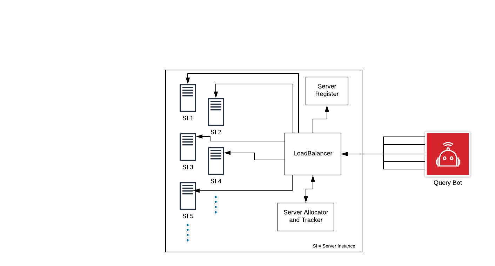

## Load Balancer

* We register all instances of our `Server Register`.
* A query bot will be used to process queries at a very fast rate in async manner.
* We log statistics of each server instance.
* `Server Allocator` allocates servers in a Round-Robin fashion.

### Aim
   All Server instances must share equivalent load and incase of server failure, LoadBalancer must take care of it and distribute requests on other instances.

